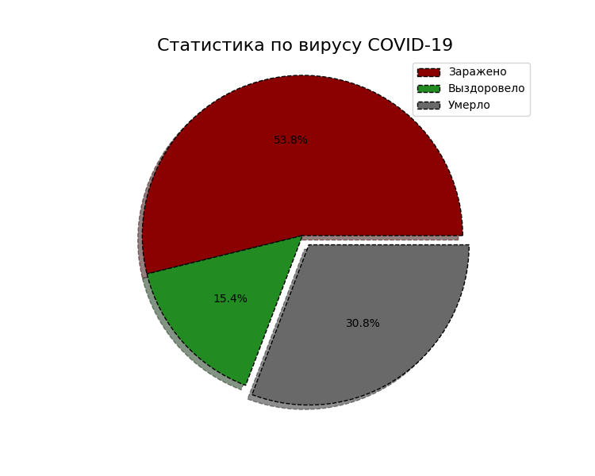

# python_developer_hw2
Репозиторий для проверки домашки №2 по курсу "Разработчик Python"

## Проверка ДЗ

1. В файле homework/config.py заполняете все константы своими значениями
2. Размещаете классы Patient и PatientCollection в файле homework/patient.py
3. ```pytest tests```

Если всё ок, то Pull-request в этот репозиторий 

# Особенности выполнения задания:
1. Поле *first_name* объекта класса **Patient()** проверяется в интернете на существование (модули *requests* и *BeautifulSoup4*).
**Используемый ресурс:** <http://imenator.ru/>
2. Поле *last_name* объекта класса **Patient()** проверяется в интернете на существование (модули *requests* и *BeautifulSoup4*).
**Используемый ресурс:** <http://www.ufolog.ru/names/>
3. Для поля *birth_date* реализован парсер, распознающий:
 + "1991---02---20";
 + "1991-02-20";
 + "1991.02.20";
 + "1991/02/20";
 + "1991//02//20";
 + "1991..02..20" и другие.
4. Для поля *phone* реализован парсер, распознающий:
 + "+7 (999) 333-22-11";
 + "8(999)333-22-11";
 + "79993332211";
 + "+8(999)(333)22)11)";
 + "+7999333-22-11";
 + "+7(999)3332211";
 + "89993332211";
 + 89_993_332_211 (т.е. int) и другие.
5. Для поля *document_type* реализован мощный парсер на базе нечёткого сравнения (модуль *fuzzywuzzy*), который ещё способен сравнивать строки со *сбившейся раскладкой* (**rus-eng**) и *регистром*, распознающий: 
 + Распознает **"Паспорт РФ"**: *"ПАСПОРТ РФ"*, *"пАсПордик ФР"*, *"паспорт"* и другие;
 + Распознает **"Загран. паспорт"**: *"pfuhfybxysq gfcgjhn"*, *"загранчик"* и другие;
 + Распознает **"Водительские права"**: *"djl/ghdf"*, *"права водителя"* и другие.
6. Для поля *document_id* реализован парсер, распознающий номер документа, сочитая его с **типом документа**:
 + Для **"Паспорт РФ"**: *"(0123)(456789)"*, *"01 23 456789"* и другие;
 + Для **"Загран. паспорт"**: *"12[3456789]"*, *"(12)  3456789"* и другие;
 + Для **"Водительские права"**: *"0123456789"*, *"01 23 456789"* и другие.
7. Для оптимизации памяти поле *document_type* хранится не как строка, а как один из параметров *True*, *False* и *None*. Существует словарь, в котором эти параметры сопоставляются с типом документа.
8. Реализован **алгоритм распознавания опечатки** (при помощи нечёткого сравнения) в полях *first_name*, *last_name*, *birth_date* и *document_id*. Если поле содержит опечатку, то его **можно изменить**, инача - **нельзя**.
9. Реализовано поле *_status* у объекта класса **Patient()**. Оно содержит информацию о состояние пациента: *"Болен"*, *"Выздоровел"* или *"Умер"*.
10. Для оптимизации памяти поле *_status* хранится не как строка, а как один из параметров *True*, *False* и *None*. Существует словарь, в котором эти параметры сопоставляются со статусами пациента.
11. Реализованы методы *recovered()* и *dead()*, с помощью которых можно изменять **статус пациента**.
12. Реализован метод *get_statistical_chart()* класса **PatientCollection()**, который выводит круглую диаграмму (модуль *matplotlib*) с информацией о зараженных, выздоровеших и умерших людях. Вот пример работы функции:



13. Методы для работы с **.csv** реализованы в двух вариантах: через *pandas* и через *with open*. Мне стало интересно сравнить эти два подхода.

 ## PANDAS VS. WITH OPEN
 Я запустил 10 раз тесты: 5 раз, используя *pandas-методы*, и 5 раз, используя *with_open-методы*.
 Вот полученные результаты:
 
| № | PANDAS | WITH OPEN |
| ------ | ------ | ------ |
| 1 | 81.40 | 81.25 |
| 2 | 82.64 | 83.35 |
| 3 | 81.97 | 82.47 |
| 4 | 83.75 | 81.94 |
| 5 | 80.35 | 80.68 |
| \<T> | 82.022 | 81.938 |

Как видно из таблицы, среднее время прохождения тестов лучше у метода, реализованного на базе ***with open***.
Я читал, что при работе с **.csv** предпочтительнее использовать модуль **pandas**. Он написан на базе модуля *NumPy*, который написан на *Си*.

Но *CPython* во многом написан на *Си*, может быть этим объясняется такая высокая скорость работы метода **with open**. Быть может, в современной версии языка *Python* (тестировал на *3.8.2*) стало лучше использовать **with open**.
Но, быть может, выборка небольшая, и нам просто повезло наткнуться на неудачные случаи. А может быть где-то реализация не самая грамотная (есть сомнения в методе _save_by_pandas(): сначала мы считываем все данные из файла, потом изменяем (дополняем) их, а потом записываем заново. Может быть pandas просто переписывает их, а не вносит изменения в старые данные. Тогда это точно не лучшая реализация).

В общем, я нашел вопрос, на который в будущем буду искать ответ.
